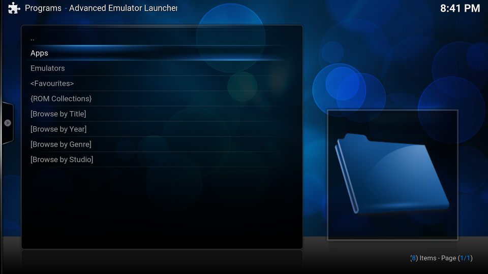
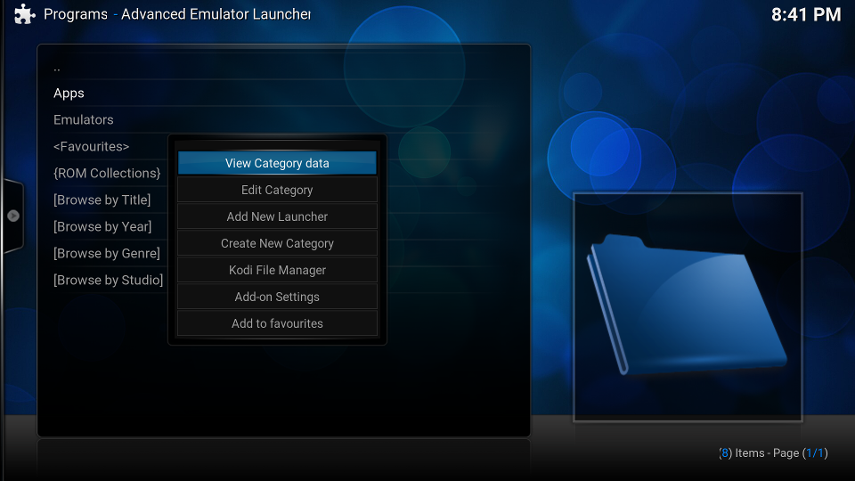

If you followed the steps in the [installation](Getting-Started-Installation) you should have a up and running Advanced Emulator Launcher plugin. Now it is time to configure it.

#### Table of Contents
[Running AEL for the first time](./Getting-Started#running-ael-for-the-first-time)  
[Creating a ROM launcher](./Getting-Started#creating-a-rom-launcher)  
[Adding ROMs to launcher](./Getting-Started#adding-roms-to-launcher)  
[Testing your launcher](./Getting-Started#testing-your-launcher)  
[What to do next?](./Getting-Started#what-to-do-next)  

### Running AEL for the first time

The first time AEL runs a default configuration is created automatically. This configuration includes an empty category named **Emulators**. Every ROM or standalone launcher in AEL must be located into some category. In the next shot, a new category called **Apps** has been created:

Notice that on addition of the Categories, AEL also includes 3 special categories: `<Favourites>`, `{ROM Collections}` and the virtual launchers `<Browse by Title>`, '`<Browse by Year>`', `<Browse by Genre>` and `<Browse by Studio>`.

An important concept in Advanced Emulator Launcher is the **context menu**. In Kodi, you can acces this context menu by pressing the key `C` in your keyboard. For example, move the arrows, select the `Apps` category and press `C` to bring the context menu. You should see something like this:

From the context menu you have access to actions like **editing the selected category**, **creating a new launcher** inside that category, and open de **addon settings**. It is very important to note that the context menu in AEL changes depending if you have selected a category, a launcher, a ROM or a special category.

Next, it is time to create our first launcher!

 * If you want to launch an emulator then create a [ROM launcher](#Creating-a-ROM-launcher).

 * If you want to launch a standalone application, for example an executable game, then
   create a [standalone launcher](#Creating-a-standalone-launcher).

### Creating a ROM launcher

You have some MAME ROMs and you want to create a MAME launcher in Advanced Emulator Launcher. In this example let's assume your are running Kodi in Kodibuntu Linux, however the concepts and ideas would be similar if you are using Windows, Android or IOs.

Your MAME executable is located in `/usr/games/mame` and the MAME ROMs are located in `/home/kodi/ROMs-mame`. 

 1. First, create a directory to store the launcher assets/artwork. For example, `/home/kodi/assets-mame`.
 
 2. In AEL root window, navigate to the category where you want to create the launcher. Bring the context menu and select **Add New launcher**.
 
 3. In the **Create New Launcher** dialog, select **ROM launcher (Emulator)**. Now, the launcher setup process start.
 
 4. Select the launcher application. In this example, navigate your filesystem, select the file `/usr/games/mame` and press **OK**.

 5. Next, select the ROMs path. In our example, navigate to the directory `/home/kodi/ROMs-mame` and press **OK**.
    
 6. AEL will fill automatically the **file extensions** for some well-known emulators. In our MAME example, set `zip|7z` as your **file extensions**.
    
 7. AEL will fill automatically the **application arguments** for some well-known emulators. In our MAME example, set the **application arguments** to `"%rom%"`.
    
    Note that when you launch a ROM, AEL will substitute `%rom%` by the file name of the ROM. The quotes `"` are necessary if your ROM filenames have spaces. Otherwise, MAME will rail to run
    your ROMs.
    
 8. Set the title of the launcher. By default AEL fills in the name of the application selected in step 4. In this example, change the title of the launcher to **MAME**.
    
 9. Select the **system platform**. In this example, chose **MAME** as the platform.
 
 10. Finally, select the directory where AEL will store the launcher assets/artwork. In this example, navigate to the directory `/home/kodi/assets-mame` and press **OK**.
     
AEL should notify you that a new launcher called **MAME** has been created. Now you can enter the category and you will see your brand new **MAME** launcher. If you now enter the launcher, AEL will notify you that: **Launcher XML/JSON file is missing. Add items to launcher first**. It is time now to add your ROMs into the launcher.

### Adding ROMs to launcher

Now that the launcher has been created, it is time to populate it with your ROMs.
 
 1. Select the MAME launcher and bring the context menu. In the launcher context menu, select
    **Add ROMs**.
    
 2. A new window will show up. Select **Scan for New ROMs**.
 
 3. AEL will start the **ROM scanner**. The **ROM scanner** will inspect the contents of the ROMs directory and will add to the launcher those files that match the file extensions configured for the launcher.
    
    The **ROM scanner** also scrapes metadata and assets for each ROM.
 
 4. When the scanner finishes your are ready to test your launcher.

### Testing your launcher

If everything went well, navigate to your launcher, press enter, and you should see all your ROMs. Select the ROM you want to play, press enter, and MAME should launch your selected ROM!

### What to do next?

*To be written*
