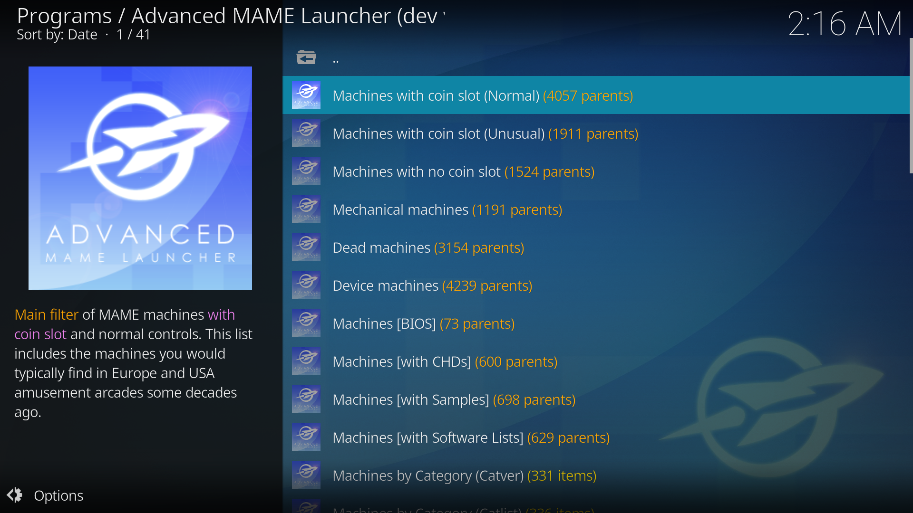

#### Table of Contents ####

 * [AML root window](#AML-root-window)

### AML root window ###

AML's root window looks like this:



The number of MAME Machines, about 40,000, is astonishingly big and it would be not practical nor convenient to browse all of them on the same list. Hence, AML includes a set of filters that will show only the Machines that meet the filtering condition. There are four kinds of MAME filters:

  1. **Main filters** Machines (with coin slot), Machines (no coin slot), Machines (mechanical) and Machines (dead).

     Machines (with coin slot) roughly correspond with the arcade machines and *Machines (no coin slot)* roughly correspond with console/computer/calculator Machines (the ones formerly in MESS). Dead machines are those with preliminary driver status (do not work) and have no controls (you cannot interact with them in any way). The Main filters are mutually exclusive. For example, Machines (with coin slot) actually means Machines with coin slot and not mechanical and not dead.

  2. **Binary filters** Machines with CHDs, Machines with Samples, Machines BIOS.

     The binary filters define ON/OFF conditions. For example, a given Machine may have CHDs or not, may be a BIOS or not, etc.

  3. **Catalog filters** Machines by Category, Machines by Manufacturer, etc.

     When you enter these filters you are shown a catalog defined by the filter. For example, if you enter the Machines by Manufacturer filter you are presented with a list of all manufacturers, if you enter one manufacturer then the whole list of Parent machines by that manufacturer is shown.

### MAME Parent machine list ###

When you enter any of the filters a list of Parent Machines is displayed:


Every item in the list contains the name of the Machine and a set of flags at the end. For example:

```
Dino (rev B) Rc-- [Dev][BIOS][Clo][status]
| | | | |------- Driver status flag
| | | |------------- Parent/Clone flag
| | |-------------------- BIOS flag
| |------------------------- Device flag
|------------------------------- Machine status flag
```

#### Machine status flag ####

The Machine status flags reports whether a Machine has ROMs, CHDs, Samples and Software Lists. After the main MAME database has been created you will see either **-** or **?**, meaning that the machine does not have Roms, Chds, Samples or software Lists or the machine have them, respectively. The ROM scanner will check the existence of the ROMs/CHDs/Samples and change the **?** flag into the appropriate lower case letter or upper case letter.

```
RCSLD
|||||- Device flag
||||-- Software Lists flag
|||--- Samples flag
||---- CHDs flag
|----- ROMs flag

- Does not have ROMs/CHDs/Samples/SLs
? Machine has ROMs/CHDs/Samples but ROMs have not been checked
r Missing ROMs/CHDs/Samples/SLs (you cannot run the machine)
R You have the ROMs/CHDs/Samples/SLs (you can run the machine)
[/syntax]
```

#### Device flag ####


#### Clone flag ####


#### Driver status flag ####

The Driver status flag reports about the quality of the emulation of the Machine. It may have any of these 3 values.

```
empty Driver status is Good
[Imp] Driver is Imperfect. It works but emulation may have some glitches
[Pre] Driver is Preliminary and emulation not working.
```

### MAME Clone machine list ###

When you enter any parent Machine a new window containing both the Parent and Clone Machines is shown. If you click on any Machine in the Parent/Clone list MAME will be launched to play that Machine. Note that you will need to have the corresponding ROMs/CHDs to execute the Machine.


### MAME machine context menu ###

*Describe the context menus when activated over a MAME machine.*

### Customisation and options ###

#### Machine display ####

*Describe the settings options to display working, non-working, mature, etc., in AML settings.*

#### Filter display ####

*Describe how to activate/deactivate the filters in AML settings.*

#### Machine listing mode ####

*Describe the Parent/Clone*
