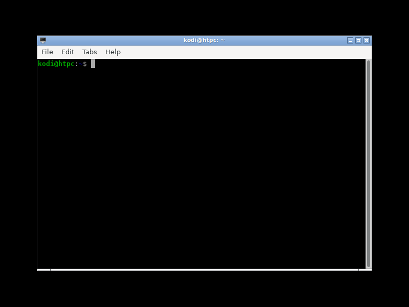

- TOC
{:toc}

[Go to main page](../)

In this chaper I cover the installation of Ubuntu Linux on a PC architecture with an Intel graphics card. After finishing this chapter you will have a working home theater personal computer (HTPC) with the network configured and ready to install Kodi or EmulationStation as your frontend and optionally some emulators such as Retroarch, MAME or Mednafen.

In this guide I assume you have a Linux desktop or laptop as your main computer. Windows users will need to google a bit for additional procedures in some steps of this guide. For example, to connect to the HTPC computer using SSH Linux users can do it natively, Windows users need to use additional software such as [PuTTY](https://www.putty.org/).

During normal use of your HTPC your will control it with a gamepad, ether if you choose Kodi or EmulationStation as the main frontend. However, a keyboard and mouse will be required during the installation and configuration. You can use the wireless interface to connect to the internet, however during the installation a wired connection is necessary to setup the wifi interface. If you want to store your media in a NAS I strongly recommend to connect the NAS and the HTPC with a wired Ethernet connection.

This tutorial focuses on using an Intel video card because it is available as an integrated video card in 99% of al PCs and usually works plug-and-play. If you want to use your discrete AMD or NVidia card you need to do some changes related to the video configuration.

In Linux/Unix usually here are several ways of doing things, each with its pros and cons. In this guide I will use `systemd` as much as possible to configure services. This sometimes makes the configuration slighly more complicated that alternatives but saves memory and resources in your HTPC which is good for low-end PCs.

## User name and HTPC computer name

When you install Ubuntu Linux you are asked for a regular or unprivileged user name. In this guide I use the `kodi` user name with home directory `/home/kodi`. Note that you can choose the user name you want, however **BE AWARE** that you will need to change some configuration files and file path names to mach the user name.

In this guide your HTPC computer will be named `htpc`. Again, you can use the name you want but pay attention because you will need to change some commands and/or configuration files to match your HTPC name. For example, to connect to your HTPC computer using SSH you can use `kodi@htpc` where `kodi` is the user name and `htpc` is the HTPC computer name. If you use different values for the user name or computer name you will need to change or adapt the instructions of this guide accordingly.

## Preparing the installation media

We will use a USB drive to install Ubuntu 20.40 Focal Fossa.

**Step 1) Download the installation ISO image** 

Use one of the Ubuntu mirrors to download the ISO image of **Ubuntu 20.04 LTS Focal Fossa 64-bit Server install image**. The server install image installs only the minimum set of packages required to run Linux, as oppossed to the Ubuntu Desktop image which installs a lot of clutter software you do not need on an HTPC.

[Ubuntu 20.04 LTS (Focal Fossa) installation images](https://ftp.riken.jp/Linux/ubuntu-releases/focal)

**Step 2) Create a bootable USB drive** 

Plug in the USB drive and use `lsblk` to learn the USB drive name. For example:

```
wintermute@pc:~$ lsblk
NAME   MAJ:MIN RM   SIZE RO TYPE MOUNTPOINT
sdb      8:16   0 931.5G  0 disk 
└─sdb1   8:17   0 931.5G  0 part /home
sdc      8:32   0 447.1G  0 disk 
├─sdc1   8:33   0   953M  0 part /boot
├─sdc2   8:34   0  22.4G  0 part [SWAP]
└─sdc3   8:35   0 423.9G  0 part /
sdd      8:48   1   3.8G  0 disk 
├─sdd1   8:49   1   1.8G  0 part 
└─sdd2   8:50   1   3.7M  0 part 
```

One trick is to execute `lsblk` before you insert the USB drive, and then again with the USB drive inserted. The device name of the USB drive is the new one that show up. Dismount any partitions of the UBS drive if they are mounted with `umount`, in some systems partitions are mounted automatically when you insert removable drives.

Use `dd` to copy the installation ISO image into the USB drive. `sdX` is the device name of the USB drive, substitute the `X` with the appropiate letter. **BE CAREFUL** `dd` is a destructive command that will erase all the contents of the USB drive. If you specify the wrong device name you can wipe the hard disk of your computer. The `sync` command after `dd` is not strictly necessary but better safe than sorry.

```
root@pc:~# dd bs=4M conv=fdatasync status=progress if=path/to/input.iso of=/dev/sdX
root@pc:~# sync
```

[ask ubuntu: Create a bootable USB drive](https://askubuntu.com/questions/372607/how-to-create-a-bootable-ubuntu-usb-flash-drive-from-terminal)

## Installation of Ubuntu Linux

Connect the NUC HDMI port to your TV or monitor. Connect a USB keyboard. The keyboard will be used for the installation and configuration. During normal use you will use a gamepad to control Kodi or EmulationStation. However, a keyboard may be needed very occasionally for configuration purposes. When configuring the X server (graphical environment) a mouse will be needed. Finally, connect the USB drive you created in the previous step. To setup the wireless interface we need to download some software not installed by default, so during the installation process connect an Ethernet cable to the wired Ethernet adapter.

Switch on the power on the NUC. If necessary access the BIOS and configure it to boot from the USB drive. If you experience problems during the installation have a look to the [Install Ubuntu Server](https://ubuntu.com/tutorials/tutorial-install-ubuntu-server) guide.

 * Ethernet wired interfaces can be configured in the installation program.

 * Wireless interface is not autodetected in the installation program.

 * In the **Guided storage configuration** screen select **Use an entire disk** and leave the defaults. By default the server installation creates a small `/boot/efi/` partition and then another big parition to be mounted as root with `ext4` filesystem. No swap partition is created.

 * In the **Profile setup** screen, type **Kodi** as **Your name**, **htpc** as your server's name, **kodi** as your user name, and choose a simple password such as **linux**.

 * Install OpenSSH to be able to connect to the HTPC using SSH.

 * In the **Featured Server Snaps** screen do not install anything.

 * Once the installation has finished you are asked to remove the USB drive and then the machine is rebooted. After that Ubuntu Linux is installed and you can log into the system using your username/password. The graphical interface is not installed yet so you have the text-based console.

## (Optional) SSD hard disks

If you installed Linux in a SSD hard disk read this section. You can skip it otherwise.

In Ubuntu Focal Fossa, filesystems are mounted by default with the option `relatime`. Triming is set to run once a week with a systemd timer and its associated service on all hard disk that support it. This is the recommended behavior for SSDs in 2020 in Debian and other major distributions.

**Step 1) Verify trimming and mounting options**

To verify the mounting options of currently mounted filesystems use `cat /proc/mounts | grep /dev/`. Check that filesystems have the option `relatime`.

Now verify that trimming is set to run once a week:

```
$ systemctl status fstrim.timer
COMPLETE ME
```

**Step 2) Lower usage of swap**

The swappiness parameter controls the tendency of the kernel to move processes out of physical memory and onto the swap disk.

```
$ cat /proc/sys/vm/swappiness
60
```

The default setting in Ubuntu is `swappiness = 60`. A value of `5` is recommended for SSDs. Edit the file `$ sudo nano /etc/sysctl.conf` and at the and append:

```
# Reduce swappiness.
vm.swappiness=5
```

Save the file, reboot the system and verify that the swappiness is now `5`.

-----

[ask ubuntu: Is TRIM enabled on my Ubuntu 18.04 installation?](https://askubuntu.com/questions/1034169/is-trim-enabled-on-my-ubuntu-18-04-installation)

[Debian wiki: SSDOptimization](https://wiki.debian.org/SSDOptimization#Mounting_SSD_filesystems)

[SSD: how to optimize your Solid State Drive for Linux Mint and Ubuntu](https://easylinuxtipsproject.blogspot.com/p/ssd.html)

[Ubuntu help: What is swappiness and how do I change it?](https://help.ubuntu.com/community/SwapFaq#What_is_swappiness_and_how_do_I_change_it.3F)

## Initial unneeded software cleanup

**RATIONALE** The less unnecessary software the better, your HTPC will consume less memory and will boot faster.

**Step 1) Remove snap**

To remove the new Ubuntu package manager called `snap` type the following commands. This will completely remove snap, snapd, all installed snap packages and their data, and never again suggest snap packages in the software store.

```
$ sudo rm -rf /var/cache/snapd/
$ sudo apt autoremove --purge snapd
```

**Step 2) Remove DM Multipath**

Linux DM Multipath is used in servers in a datacenter for load-balancing an redudancy of block devices. We don't need this in an HTPC.

```
$ sudo apt autoremove --purge multipath-tools
```

**NOTE** The virtual package `ubuntu-server` and some others will also be removed.

**Step 3) Remove Unattended Upgrades**

You want to make sure your HTPC does not automatically upgrade software at the most incovenient moment.

```
$ sudo apt autoremove --purge unattended-upgrades
```

## Network configuration

If you are using the wired Ethernet port to connect to the internet follow the steps in the next subsection. If you want to use WiFi to connect to the Internet then first configure the wired interface and after that proceed with the configuration of the wireless adapter. The reason is that we need to download the `wpasupplicant` package which is not installed by default and it is required for the wireless adapter to work.

### Wired Ethernet interface configuration

**RATIONALE** The wired interface should be detected and configured during the installation process. However, by default Ubuntu Focal Fossa uses `netplan` to manage the network and we will switch to `systemd-networkd`.

**IMPORTANT** This steps must be done logged into the system with a keyboard. Do not use a SSH connection!

**Step 1) Identify the name of the wired interface** 

```
kodi@htpc:~$ ls /sys/class/net
eno1   lo   wlp0s20f3
```

Wired interface names start with `en`. In this case the interface name is `eno1`.

**Step 2) Remove netplan**

Some extra packages will be removed as well as they are not needed.

```
$ sudo apt autoremove --purge nplan netplan.io
```

**Step 3) Create the systemd-networkd configuration file**

Verify that the directory `/etc/systemd/network` is empty with `ls -l /etc/systemd/network`. Create the following configuration file with `$ sudo nano /etc/systemd/network/20-wired.network`. Change the line `Name=eno1` to mach the name of your wired interface name.

```
# File /etc/systemd/network/20-wired.network

[Match]
Name=eno1

[Network]
DHCP=ipv4
```

**Step 4) Enable the systemd-networkd service**

```
$ sudo systemctl enable systemd-networkd.service
```

**Step 5) Verify that systemd-resolved is runnning**

Check that `/etc/resolv.conf` 

```
$ ls -l /etc/resolv.conf
.....
```

Verify that `systemd-resolved` is running with `$ systemctl status systemd-resolved.service`. You should see a line like `Active: active (running) since ...`. If not, then enable the service with `$ sudo systemctl enable systemd-resolved.service`.

**Step 6) Reboot the machine and test the network**

Reboot the machine with `$ reboot`. Then, test the network with:

```
$ networkctl
COMPLETE
$ ip a
COMPLETE
$ ping google.com
COMPLETE
```

Press **Ctrl + C** to stop the `ping` command.


**Step 7) Install the package wpasupplicant**

This is only required if you plan to configure the wireless interface.

```
$ sudo apt install wpasupplicant
```

-----

[archlinux wiki: Systemd-networkd](https://wiki.archlinux.org/index.php/Systemd-networkd)

### (Optional) Wireless interface configuration

**Step 1) Identify the name of the wifi interface**

```
kodi@htpc:~$ ls /sys/class/net
eno1   lo   wlp0s20f3
```

Wireless interface names start with `w`. In this case the interface name is `wlp0s20f3`.

**Step 2) Create the systemd-networkd configuration file**

Create the following configuration file with `$ sudo nano /etc/systemd/network/30-wireless.network`. Change the line `Name=wlp0s20f3` to mach the name of your wired interface name.

```
# File /etc/systemd/network/30-wireless.network

[Match]
Name=wlp0s20f3

[Network]
DHCP=ipv4
```

**Step 3) Configure wpasupplicant**

Create the `wpasupplicant` configuration file with `$ sudo nano /etc/wpa_supplicant/wpa_supplicant.conf`. Change `"MYSSID"` and `"passphrase"` with your SSID and network password. It is important to keep the quotes.

```
# File /etc/wpa_supplicant/wpa_supplicant.conf

ctrl_interface=/run/wpa_supplicant
ap_scan=1
fast_reauth=1

# network section generated by wpa_passphrase
network={
    ssid="MYSSID"
    psk="passphrase"
    key_mgmt=WPA-PSK
}
```

Now create the `systemd` service to enabled `wpasupplicant` to control your wireless interface with `$ sudo nano /etc/systemd/system/wpa-wlp0s20f3.service`. Do not forget to change the name of your wireless interface to match your system in all places in the configuration file and also in the configuration file name:

```
# File /etc/systemd/system/wpa-wlp0s20f3.service

[Unit]
Description=WPA supplicant for interface wlp0s20f3
DefaultDependencies=no
Requires=sys-subsystem-net-devices-wlp0s20f3.device
After=sys-subsystem-net-devices-wlp0s20f3.device
Before=network.target
Wants=network.target

[Service]
Type=simple
ExecStart=/sbin/wpa_supplicant -c /etc/wpa_supplicant/wpa_supplicant.conf -iwlp0s20f3
```

**Step 4) Configure systemd-resolved**

Check if `/etc/resolv.conf` points to the `systemd-resolved` file:

```
$ ls -l /etc/resolv.conf
COMPLETE ME
```

If not, execute the following commands:

```
# rm /etc/resolv.conf
# ln -s /run/systemd/resolve/resolv.conf /etc/resolv.conf
```

**Step 4) Enable systemd services and configure resolved**

First enable all the `systemd` services:

```
# systemctl enable wpa-wlp0s20f3.service
# systemctl enable systemd-networkd.service
# systemctl enable systemd-resolved.service
```

Check your configuration.

```
$ systemctl is-enabled wpa-wlp0s20f3.service
$ systemctl is-enabled systemd-networkd.service
$ systemctl is-enabled systemd-resolved.service
```

**Step 5) Reboot the machine and test the network**

Reboot the machine with `$ reboot`. After rebooting test the network as described in the previous section but look for the wireless interface instead of the wired one.

-----

[archlinux wiki: wpa_supplicant](https://wiki.archlinux.org/index.php/wpa_supplicant)

[Manjaro: How to use systemd-networkd to manage your wifi](https://forum.manjaro.org/t/how-to-use-systemd-networkd-to-manage-your-wifi/1557)

## Installing software

Now install some software packages including the X server (graphical environment).

```
root@htpc:~# apt install alsa-utils lm-sensors udisks2 avahi-daemon
root@htpc:~# apt install dbus-x11 openbox
root@htpc:~# apt install xorg xserver-xorg-legacy lxterminal mousepad
root@htpc:~# apt install va-driver-all i965-va-driver-shaders
root@htpc:~# apt install mesa-utils vulkan-tools vainfo
root@htpc:~# apt install xdg-utils
```

`lxterminal` is a minimalist terminal emulator for the X server with few dependencies. `mousepad` is a good text editor for the X server with few dependencies. `xdg-utils` installs `xdg-screensaver` which is used by Retroarch to control the screensaver.

**NOTE** The packages `ssh`, `software-properties-common`, `linux-firmware`, `git`, `pastebinit` are installed by default in Ubuntu Focal Fossa server.

## Basic HTPC configuration

Allow **anybody** to start the X server:

```
root@htpc:~# dpkg-reconfigure xserver-xorg-legacy
```

Now edit `/etc/X11/Xwrapper.config` and add the following into a new line at the end of the file:

```
needs_root_rights=yes
```

Give privileges to the **kodi** user you created in the installation:

```
root@htpc:~# usermod -a -G cdrom,audio,video,plugdev,users,dialout,dip,input kodi
```

You can check the groups the user kodi belongs with:
```
root@htpc:~# groups kodi
kodi : kodi adm ...
```

Now create the file `/home/kodi/.xinitrc` that will be used by `startx`.

```
# File /home/kodi/.xinitrc

# Execute an Openbox window manager session.
# Openbox will execute the contents of /home/kodi/.config/openbox/autostart
exec openbox-session
```

Now create the file `/home/kodi/.config/openbox/autostart`. Remeber that the lines that start with a `#` are comments and are not necessary.

```
# File /home/kodi/.config/openbox/autostart
# Commands here are blocking. Use a trailing & to run concurrently.

# Enable full color range in the connected display.
OUTPUT=`xrandr -display :0 -q | sed '/ connected/!d;s/ .*//;q'`
xrandr -display :0 --output $OUTPUT --set "Broadcast RGB" "Full"

# Set the background to black.
xsetroot #000000

# Disable the screensaver and the power management.
# To check the status of the screensaver use the command `$ xset q`
# If you connect via SSH execute `$ export DISPLAY=:0` before commands
# like `xset` or `glxinfo`.
xset s off -dpms

# Launchg a terminal emulator
lxterminal &
```

At this point you can test the X server (graphical interface). You will need a mouse to use the X server.

```
kodi@htpc:~$ startx
```

The screen will turn black (don't panic) and you will see the mouse pointer in the middle of the screen. With a right click you can open the Openbox context menu and launch a graphic terminal. In the graphic terminal type `glxinfo`, `vulkaninfo` and `vainfo` to check that the OpenGL acceleration, Vulkan acceleration and VA-API are working well.



To exit the X server bring up the Openbox context menu with a mouse right click and click on **Exit**. You will return to the text console.

-----

[ArchLinux wiki Display Power Management Signaling](https://wiki.archlinux.org/index.php/Display_Power_Management_Signaling)

## Set permissions to shutdown, suspend and mount disks

Kodi and EmulationStation will use D-Bus to reboot and power off your HTPC and it is necessary to give privileges to the Kodi user. Create the file `/etc/polkit-1/localauthority/50-local.d/custom-actions.pkla`.

```
# File /etc/polkit-1/localauthority/50-local.d/custom-actions.pkla root:root 644
[Actions for kodi user]
Identity=unix-user:kodi
Action=org.freedesktop.login1.*;org.freedesktop.udisks2.*
ResultAny=yes
ResultInactive=yes
ResultActive=yes

[Untrusted Upgrade]
Identity=unix-user:kodi
Action=org.debian.apt.upgrade-packages;org.debian.apt.update-cache
ResultAny=yes
ResultInactive=yes
ResultActive=yes
```

## (Optional) Connecting to the HTPC with SSH

In your Linux desktop/laptop edit the file `/etc/hosts` and append at the end.

```
192.168.0.20   htpc
```

Change the IP address to the one you have assigned in your router to the HTPC computer. I recommend to assign a static IP address so it does not change when you reboot your computers. To learn the MAC address of the WiFi interface of your HTPC use the `ip a` command in the HTPC. After that, you can connect to your HTPC with `ssh kodi@htpc`.

If you don't modify `/etc/hosts` then you need to use the **IP adress** of your HTPC instead of the network name.

## (Optional) Change priority of user kodi

Edit `/etc/security/limits.conf` and add before the end. Remember `kodi` is the username, not the application. This will allow your user to get the audio thread a bit more priority.

```
kodi             -       nice            -1
```

## (Optional) Changing the time zone

By default the UTC is used. Kodi and many emulators require that the time is correctly set to work properly. To set the correct time execute:

```
root@htpc:~# dpkg-reconfigure tzdata
```

By default `systemd` automatically sets the time of your HTPC from the network so the only thing you need to do is to configure the correct time zone where you are located.

[archlinux wiki: systemd-timesyncd](https://wiki.archlinux.org/index.php/systemd-timesyncd)

## (Optional) Install Plymouth

Plymouth enables a graphical boot process as opposed to systemd printing lots of text. Also, by loading the module **i915** for Intel video cards into your initramfs (the first step in the boot process) you enable kernel video mode (KMS) setting which avoids flickering in your display during the boot process.

Plymouth seems to be already installed but it is not enabled in Ubuntu Focal Fossa. It doesn't hurt to make sure it is installed:

```
root@htpc:~# apt install plymouth plymouth-theme-ubuntu-logo plymouth-themes
```

Edit the file `/etc/initramfs-tools/modules` and add at the end:

```
# Intel graphics card.
i915 modeset=1
```

Then update the initramfs with `sudo update-initramfs -u`

Edit the file `/etc/default/grub` and add the `splash` word to:

```
GRUB_CMDLINE_LINUX_DEFAULT="splash"
```

If there are more arguments then add `splash` at the end separated with one space from the previous word. Now execute `sudo update-grub`. You can check the current kernel command line with `cat /proc/cmdline` if you run into trouble.

To change the plymouth theme execute:

```
root@htpc:~# update-alternatives --config default.plymouth
root@htpc:~# update-initramfs -u
```

To search for themes use `apt search plymouth theme` and then install the themes you want with `sudo apt install`.

----------

Plymouth documentation can be found in `/usr/share/doc/plymouth/`, to read it execute `$ zless /usr/share/doc/plymouth/README.Debian`.

## (Optional) Change the console font size

The default console size is rather small and can be inconvenient if your HTPC is connected to a big screen or TV. To change the default console font execute:

```
root@htpc:~# dpkg-reconfigure console-setup
```

Make sure you choose **UTF-8** as the encoding, choose the default in the character set, choose **VGA** as the font for the console, finally choose the `16x28` or `16x32` size. To roll back you changes and set the default values, execute `dpkg-reconfigure console-setup` and choose **Fixed** font and `8x16` size.
