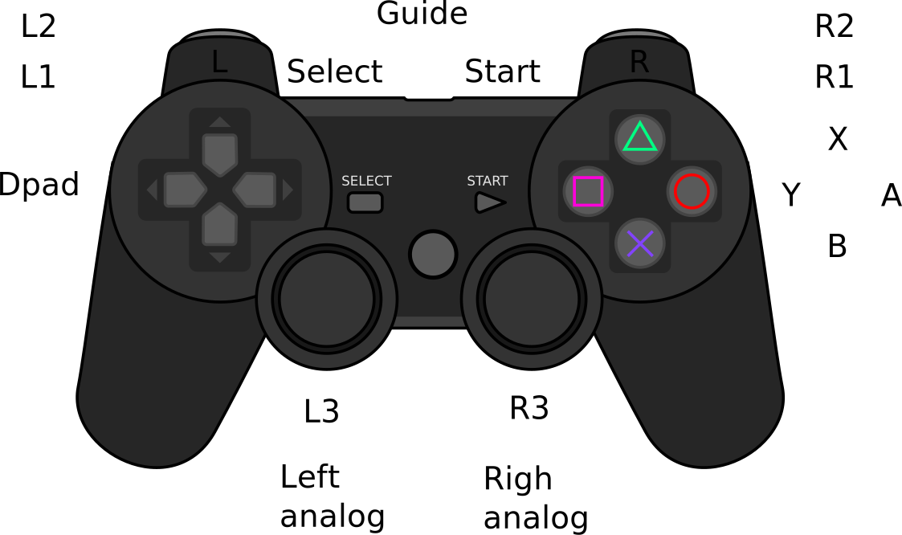

- TOC
{:toc}

[Go to main page](../)

## MAME

The Multi Arcade Machine Emulator (MAME) needs little introduction.

If you have doubts check the [MAME FAQ](http://www.mamedev.org/devwiki/index.php?title=Frequently_Asked_Questions).

## Controlling MAME with a gamepad

You will need a keyboard to configure your gamepads in MAME. Once the gamepads are configured the keyboard is not needed.

 * The default control configuration file is `~/.mame/cfg/default.cfg`. Delete this file to restore 
   all controls to its default values.

 * More than one key or button can be mapped to MAME virtual controls.
   It is recommended to map a joystick button and simultaneously keep the default MAME keyboard
   key mapped.

 * <kbd>ENTER</kbd> + <kbd>ESC</kbd> sets a command to `None`.

 * <kbd>ENTER</kbd> + <kbd>ESC</kbd> on a `None` command sets the command to its default value.

What was the control to switch beteen keyboards when emulating computers??? `SysRq` or `Scr Lk` 

The following table describes the main controls you need to configure in your gamepad and the default key in the keyboard. Bring the MAME menu with the `TAB` key and enter the **Input (general)** menu.

| Sub menu          | Name           | Key               | Description           |
|-------------------|----------------|-------------------|-----------------------|
| User interface    | `Config Menu`  | <kbd>TAB</kbd>    | Open/close the MAME menu |
| User interface    | `UI Up`        | <kbd>UP</kbd>     |
| User interface    | `UI Down`      | <kbd>DOWN</kbd>   |
| User interface    | `UI Left`      | <kbd>LEFT</kbd>   |
| User interface    | `UI Right`     | <kbd>RIGHT</kbd>  |
| User interface    | `UI Page Up`   | <kbd>PGUP</kbd>   |
| User interface    | `UI Page Down` | <kbd>PGDN</kbd>   |
| User interface    | `UI Select`    | <kbd>RETURN</kbd> | 
| User interface    | `UI Cancel`    | <kbd>ESC</kbd>    | Go back in menu and exit MAME |
| Player 1 Controls | `P1 Up`      | <kbd>UP</kbd> |
| Player 1 Controls | `P1 Down`    | <kbd>DOWN</kbd>  |
| Player 1 Controls | `P1 Left`    | <kbd>LEFT</kbd> |
| Player 1 Controls | `P1 Right`   | <kbd>RIGHT</kbd> |
| Player 1 Controls | `P1 Button1` | <kbd>LCONTROL</kbd> |
| Player 1 Controls | `P1 Button2` | <kbd>LALT</kbd> |
| Player 1 Controls | `P1 Button3` | <kbd>SPACE</kbd> |
| Player 1 Controls | `P1 Button4` | <kbd>LSHIFT</kbd> |
| Player 1 Controls | `P1 Button5` | <kbd>Z</kbd> |
| Player 1 Controls | `P1 Button6` | <kbd>X</kbd> |
| Player 1 Controls | `P1 Start`   | <kbd>1</kbd> | Start for console machines |
| Player 1 Controls | `P1 Select`  | <kbd>5</kbd> | Select for console machines |
| Other controls    | `1 Player Start` | <kbd>1</kbd>  | Start for arcade machines |
| Other controls    | `Coin 1`         | <kbd>5</kbd>  | Insert coin for arcade machines |
| Other controls    | `Service`        | <kbd>F2</kbd> | Service menu of arcade machines |

## Recommended gamepad mapping

This is the typical layout of a gamepad.

<center></center>

And the recommended MAME control bindings:

| Retropad name | Kodi name     | MAME control                     |
|---------------|---------------|----------------------------------|
| B          | A             | `P1 Button 1`                    |
| A          | B             | `P1 Button 2`                    |
| Y          | X             | `P1 Button 3`                    |
| X          | Y             | `P1 Button 4`                    |
| SELECT     | Select        | `Coin 1` and console select      |
| GUIDE      | Guide         | `UI Cancel`                      |
| START      | Start         | `1 Player Start` and console start |
| L1         | Left Bumper   | `P1 Button 5` and `UI Page Up`   |
| R1         | Right Bumper  | `P1 Button 6` and `UI Page Down` |
| L2         | Left Trigger  | `P1 Button 7`                    |
| R2         | Right Trigger | `P1 Button 8`                    |
| L3         | Left Thumb    | `Service` and UI keyboard ...    |
| R3         | Right Thumb   | `Config Menu`                    |
| Dpad Up    | Dpad Up       | `P1 Up`                          |
| Dpad Down  | Dpad Down     | `P1 Down`                        |
| Dpad Left  | Dpad Left     | `P1 Left`                        |
| Dpad Right | Dpad Right    | `P1 Right`                       |

## Updating MAME (optional)

The MAME version in Trusty is old (0.152). The following
<ulink url="https://launchpad.net/~c.falco/+archive/mame">PPA</ulink>
contains up-to-date versions of MAME. Create the file 
<filename>/etc/apt/sources.list.d/mamePPA.list</filename> 
and insert

```
<programlisting>
# Cesare Falco unofficial MAME builds
deb http://ppa.launchpad.net/c.falco/mame/ubuntu trusty main 
deb-src http://ppa.launchpad.net/c.falco/mame/ubuntu trusty main 
</programlisting>
```

It's much more convenient to configure MAME to 
use an offline scraper, and provide the downloaded artwork and games description
files. Have a look at
https://code.google.com/p/romcollectionbrowser/wiki/HowToAddMAMEOffline

## Basic MAME setup

The first time that MAME is run it will
create the directory <filename>~/.mame</filename> to store its stuff. A full screen
information window will show up stating "No games found. Check your rompath".

The first step is to create a default configuration file and move it
to the <filename>~/.mame</filename>. Execute

<screen>
$ mame -createconfig
$ mv mame.ini .mame
</screen>

Create a folder <filename>~/ROMs/roms-mame</filename> and put some MAME ROMs there to test

```
$ mkdir ~/ROMs/roms-mame/
$ cp romName.zip ~/ROMs/roms-mame/
```

Next, edit the mame configuration file <filename>~/.mame/mame.ini</filename> and locate the following line

```
...
rompath $HOME/mame/roms;/usr/local/share/games/mame/roms;/usr/share/games/mame/roms
...
```

and change it into this

```
...
rompath $HOME/ROMs/roms-mame
...
```

If you now execute MAME it will show you a list of the games you copied into <filename>~/ROMs/roms-mame</filename> and also an option to configure the controls.

## Running MAME from the command line

This is an example of how to run MAME from the command line.

<screen>
$ mame romName
</screen>

MAME uses the SDL library
for video and sound. If you want to force SDL to use ALSA and a specific
sound card other than the default then execute

<screen>
$ export SDL_AUDIODRIVER=alsa
$ export AUDIODEV=hw:1,3
$ mame romName
</screen>

By default, MAME should start in full screen mode. If not,
edit <filename>~/.mame/mame.ini</filename> and change

```
...
window 1
...
```

into

```
...
window 0
...
```

## Basic MAME usage

MAME has a nice in-game menu that can be used to change the controls and other settings. This is a short list of the most useful default controls.

| Key | Control |
|-----|---------|
| `TAB` | Open/Closes the in-game configration menu. |
| `Esc` | Exits the emulator. User Interface cancel. |
| `5`  | Player 1 insert coin |
| `1` | Player 1 start |

## Control configuration

Most controls can be configured from the in-game menu, as described [here](http://www.mamedev.org/devwiki/index.php?title=FAQ:Controls#How_do_I_configure_the_keys.3F").

Press <keycap>Tab</keycap> in-game and choose Input: general
to configure controls for all games, or Input: This Game to
change controls only for the running game. Then, select the input you want to configure, press enter 
followed by the key you want it mapped to. More fancy key combinations can be made. 
To map this key OR that key, set one of the keys as before, wait until 
MAME accepts it, then repeat for second key.


For the Logitech F710 joystick, this are the recommended controls to remap

In Input: general -> Player 1 controls remap P1 Up, P1 Down, P1 Left, P1 Right to the joystick D-pad and the keyboard arrows.

In Input: general -> Player 1 controls remap P1 Button 1, P1 Button 2, P1 Button 3, and P1 Button 4 to the joystick 4 central buttons (and some keys if you want).

In Input: general -> Other controls remap 1 Player Start to the joystick <keycap>START</keycap> button and Coin 1 to the joystick <keycap>BACK</keycap> button.

Finally, in Input: general -> User Interface 
remap UI Select to the joystick button <keycap>A</keycap> and to
the default key <keycap>RETURN</keycap> (it is important to being able to control the
User Interface both with the joystick and the keyboard),
Config Menu to the joystick button <keycap>Right analog pad center</keycap>
and to the default key <keycap>TAB</keycap>, and
UI Cancel to the F710 joystick button <keycap>Logicool button</keycap>
and to the default key <keycap>ESC</keycap>.
Note that UI Cancel is used to exit the menu, but also to
exit the emulator and return to XBMC.

Additionally, controls can be configured editing the file `~/.mame/cfg/default.cfg`, which is an XML file. You will only see entries in this file for key bindings you have modified (an not the defaults). Editing this file is useful when you do a mistake using the User Interface and want to roll-back to default controls. If you decide to change this file,  keep in mind that in MAME joystick buttons are numbered from 1 to N, not from 0 to N-1 like in `jstest`.
