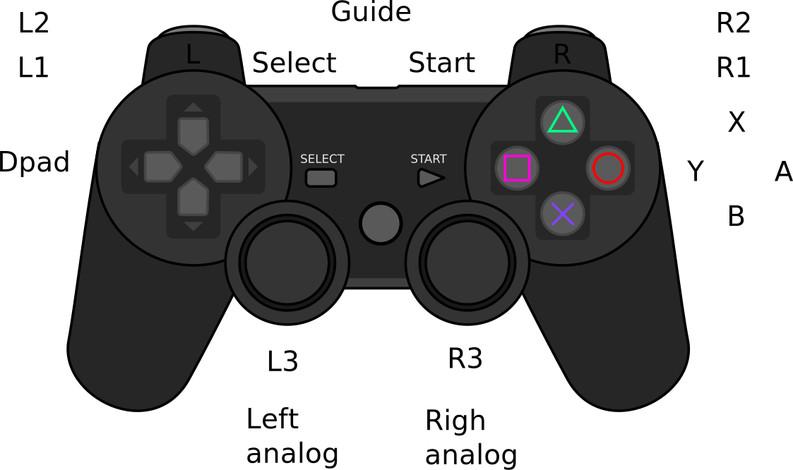

# MAME basic usage #

## Controlling MAME with a gamepad ##

 * The default control configuration file is `~/.mame/cfg/default.cfg`. Delete this file to restore 
   all controls to its default values.

 * More than one key or button can be mapped to MAME virtual controls.
   It is recommended to map a joystick button and simultaneously keep the default MAME keyboard
   key mapped.

 * <kbd>ENTER</kbd> + <kbd>ESC</kbd> sets a command to `None`.

 * <kbd>ENTER</kbd> + <kbd>ESC</kbd> on a `None` command sets the command to its default value.

What was the control to switch beteen keyboards when emulating computers???

**Menu `Input (general)`, submenu `User Interface`**

| Name           | Key               | Description           |
|----------------|-------------------|-----------------------|
| `Config Menu`  | <kbd>TAB</kbd>    | Brings the MAME menu. |
| `UI Up`        | <kbd>UP</kbd>     |
| `UI Down`      | <kbd>DOWN</kbd>   |
| `UI Left`      | <kbd>LEFT</kbd>   |
| `UI Right`     | <kbd>RIGHT</kbd>  |
| `UI Page Up`   | <kbd>PGUP</kbd>   |
| `UI Page Down` | <kbd>PGDN</kbd>   |
| `UI Select`    | <kbd>RETURN</kbd> | 
| `UI Cancel`    | <kbd>ESC</kbd>    | Go back in menu. Exits MAME. |

**Menu `Input (general)`, submenu `Player 1 Controls`**

| Name         | Key    |
|--------------|--------|
| `P1 Up`      | <kbd>UP</kbd> |
| `P1 Down`    | <kbd>DOWN</kbd>  |
| `P1 Left`    | <kbd>LEFT</kbd> |
| `P1 Right`   | <kbd>RIGHT</kbd> |
| `P1 Button1` | <kbd>LCONTROL</kbd> |
| `P1 Button2` | <kbd>LALT</kbd> |
| `P1 Button3` | <kbd>SPACE</kbd> |
| `P1 Button4` | <kbd>LSHIFT</kbd> |
| `P1 Button5` | <kbd>Z</kbd> |
| `P1 Button6` | <kbd>X</kbd> |
| `P1 Start`   | <kbd>1</kbd> |
| `P1 Select`  | <kbd>5</kbd> |

**Menu `Input (general)`, submenu `Other Controls`**

| Name             | Key    |
|------------------|--------|
| `1 Player Start` | <kbd>1</kbd> |
| `Coin 1`         | <kbd>5</kbd> |
| `Service`        | <kbd>F2</kbd> |

## Recommended gamepad mapping ##

This is the typical layout of a gamepad.

And the recommended MAME control bindings:

| Retropad name | Kodi name     | MAME control                     |
|---------------|---------------|----------------------------------|
| B          | A             | `P1 Button 1`                    |
| A          | B             | `P1 Button 2`                    |
| Y          | X             | `P1 Button 3`                    |
| X          | Y             | `P1 Button 4`                    |
| SELECT     | Select        | `Coin 1` and console select      |
| GUIDE      | Guide         | `UI Cancel`                      |
| START      | Start         | `1 Player Start` and console start |
| L1         | Left Bumper   | `P1 Button 5` and `UI Page Up`   |
| R1         | Right Bumper  | `P1 Button 6` and `UI Page Down` |
| L2         | Left Trigger  | `P1 Button 7`                    |
| R2         | Right Trigger | `P1 Button 8`                    |
| L3         | Left Thumb    | `Service` and UI keyboard ...    |
| R3         | Right Thumb   | `Config Menu`                    |
| Dpad Up    | Dpad Up       | `P1 Up`                          |
| Dpad Down  | Dpad Down     | `P1 Down`                        |
| Dpad Left  | Dpad Left     | `P1 Left`                        |
| Dpad Right | Dpad Right    | `P1 Right`                       |
